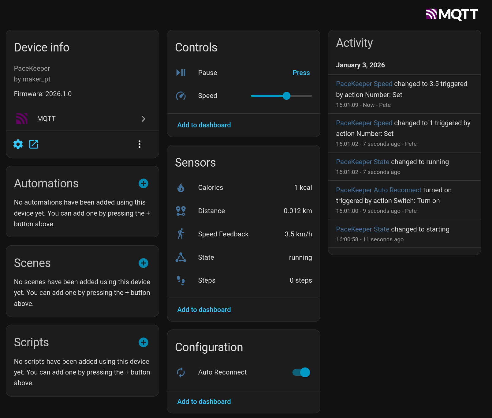

# Homebrain PaceKeeper for WalkingPads in Home Assistant

PaceKeeper is an ESP32 bridge that connects via Bluetooth to your WalkingPad and exposes the device via MQTT to Home Assistant.

See the video on Youtube:

## Supported Hardware

* PitPat-T01 Treadmill – Superun BA06-B1 [[AliExpress](https://s.click.aliexpress.com/e/_c3V1ssrv)]

## Required Tools

* ESP32 – I'm using a Wemos S3 Mini, but any ESP32 with Bluetooth should do [[AliExpress](https://de.aliexpress.com/item/1005006646247867.html)] [[Amazon](https://amzn.to/44VolhQ)]
* VS Code with PlatformIO

## Setup

### Find the Bluetooth Address of the Device

Get an app like **nRF Connect** – this app allows you to view Bluetooth connections on your phone.

* Turn the device on with the power switch
* Either use the app to initialize the device or follow the steps in the section **"Cloud Free Usage"**
* Open nRF Connect on your phone
* The device should show up as `PitPat-T01`
* Write down the Bluetooth address (it should look like `AA:BB:CC:11:22`)

### Preparation of Home Assistant for MQTT

* Add the MQTT integration and follow the setup steps:  
  <https://www.home-assistant.io/integrations/mqtt>

### Project Compilation

* Set up VS Code with PlatformIO  
  (<https://docs.platformio.org/en/latest/integration/ide/vscode.html#installation>)
* Clone this repo and open it in VS Code
* Rename `config.h.sample` to `config.h`
* Open the file and set the configuration values for MQTT and the Bluetooth address from the previous step
* Connect the ESP32 with a USB cable (you might have to hold **RST** and **BOOT** while plugging it in)
* Compile and flash the project via **PlatformIO → Upload and Monitor**
* If everything goes well, you should see a bunch of log messages, and a new device called `PaceKeeper` should show up in your Home Assistant

## Cloud Free Usage – Start Without WiFi, App, and Cloud Account

You’ll get a remote with it; it has **+**, **−**, and **play/pause** buttons. However, when you turn it on, it initially reacts with a long, annoying sound to any button press. When you turn it on with the power button, it will also take a while before showing display information, first lighting up all display segments.

That’s where you strike.

Turn it on and quickly press **(+)**; you will be greeted with a short sound. Then press **−, −, −, +, +**, wait **20 seconds**, turn it off and on again. It should now display something else, and you can start using it.

### Sequence

* Turn on using the `power` switch on the device
* Press `-` on the remote **3×**
* Press `+` on the remote **1×**
* Press `+` on the remote for **3 seconds**

Each correct input will be confirmed by a short, happy sound. Each incorrect input will be confirmed by a long, annoying sound.

Source:  
<https://www.reddit.com/r/treadmills/comments/1jtuwix/heres_how_you_unlock_superun_treadmills_without/>

## Acknowledgements

I built this with the help of many other people who put effort into reverse-engineering the Bluetooth protocol.

### Web Bluetooth App (Python)

Python web interface to control the treadmill via Bluetooth but for another model.

GitHub project:  
<https://github.com/azmke/pitpat-treadmill-control>

### Web Bluetooth App (JavaScript)

A Web Bluetooth app written in JavaScript. Fully supports the B1 as well.

GitHub project:  
<https://github.com/KeiranY/PitPat-WebBT/>

### Zwift Integration by qdomyos

There is some work in a B1 sub-branch.

Source file:  
<https://github.com/cagnulein/qdomyos-zwift/blob/master/src/devices/deeruntreadmill/deerruntreadmill.cpp>

## Further Notes

Deerrun and Superun seem to use the same OEM hardware, so it's likely that those devices might work as well.
